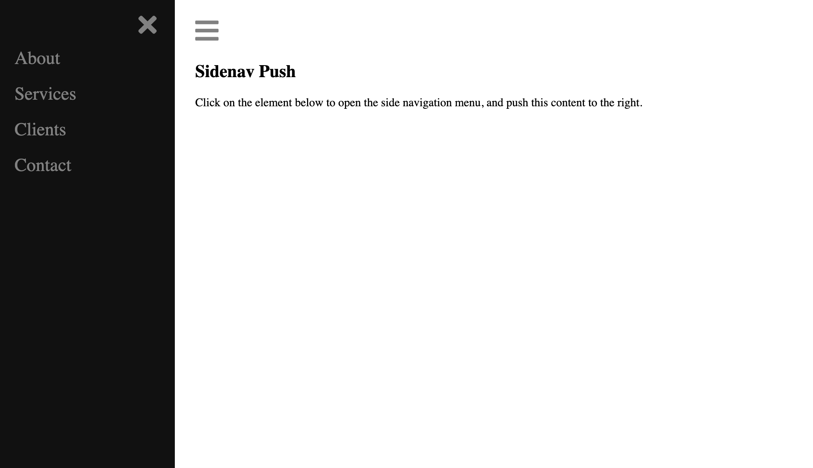

# Saturday Projects

1. Fork the repository [Saturday Projects](https://github.com/seytechschool/saturday-projects)
2. Download the source code from the forked repository
3. Start working on

## Javascript Projects

1. [Off-canvas menu](https://github.com/seytechschool/saturday-projects/tree/master/javascript/off-canvas-menu)

2. [Tip Calculator](https://github.com/seytechschool/saturday-projects/tree/master/javascript/tip-calculator)

