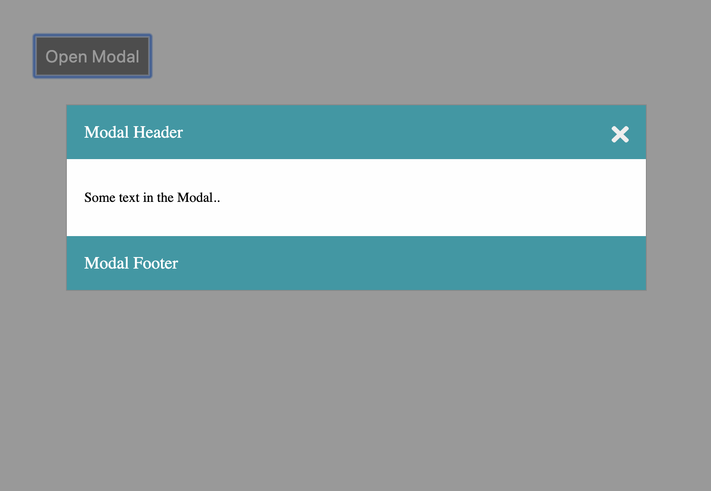

# Modal

1. Fork the repository [Saturday Projects](https://github.com/seytechschool/saturday-projects)
2. Download the source code from the forked repository
3. Start working on

## What You Should See

1. Click button to open modal.
2. If a user clicks close button or anywhere except modal it should close.

## How to do it

1. First commit should be html/css code
2. Second commit should be a js functions
5. Create a pull request when you are done

## Video 

1. `https://www.youtube.com/watch?v=mnHPRlMTVRQ`
2. 

## Given Data

1. Modal BG color: `#fefefe`
2. Modal header,footer text color: `#0d99a5`

## Hint

Hints are given on the website.