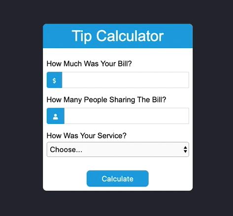

# Tip Calculator

1. Fork the repository [Saturday Projects](https://github.com/seytechschool/saturday-projects)
2. Download the source code from the forked repository
3. Start working on

## What You Should See

1. In the case of tip form calculator above, you should be able to use the calculator to enter an amount of a bill, the number of people who will split the bill, and a selection as to how the service went
2. If a user forgets to add input or if the input is blank (or less than zero), feedback should be alerted to the user
3. After the calculation user should able to clear all data clicking "clear" button

## How to do it

1. First commit should be html/css code
2. Second commit should be a calculate function
3. Third commit should be validation
4. Fourth commit should be "clear" function
5. Create a pull request when you are done

## Video 

1. `http://www.youtube.com/watch?v=DPtTX85H5fs`
2. 

## Given Data

1. Font Family: `Arial, Helvetica, sans-serif`
2. Body Bg color: `#262933`
3. Header Bg color: `#00a3e1`
4. Error Bg color: `#f8d7da`
5. Error text color: `#721c24`
6. Clear text color: `#721c24`
7. Use FontAwesome icons
8. Don't forget commenting your code
